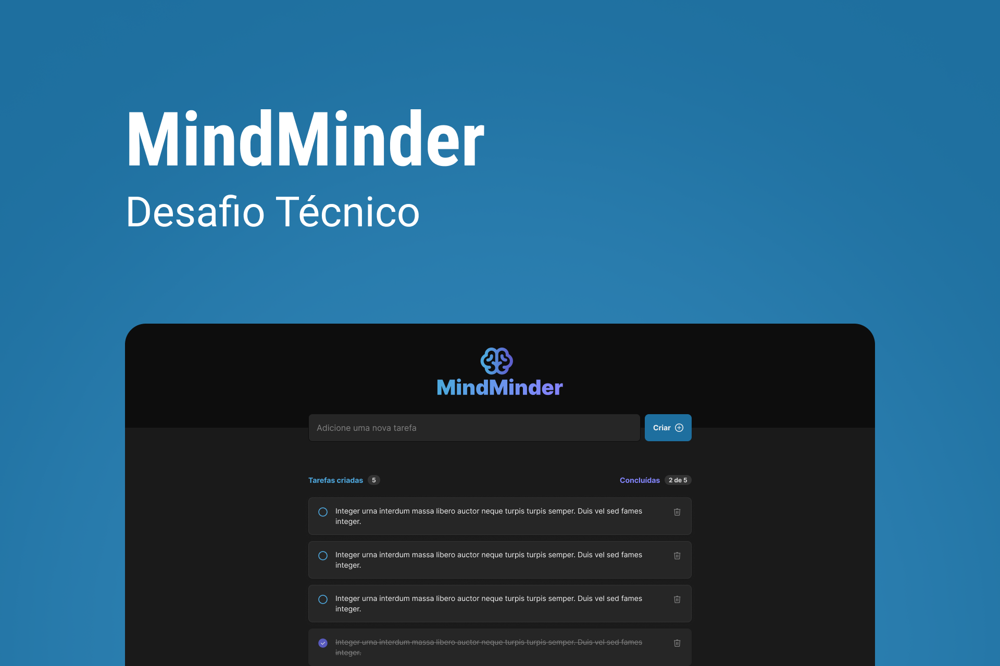
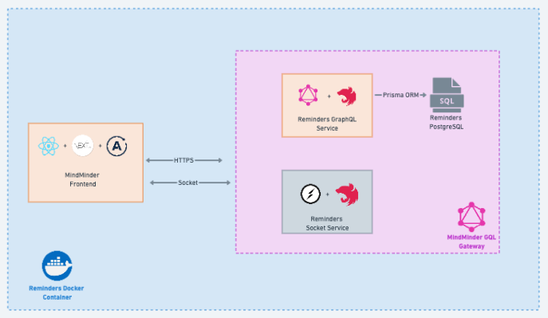

<p align="center">
     
</p>

# MindMinder
<p>
  

  
  
  <a href="https://github.com/WallysonGalvao/rocketseat-gobarber/commits/master">
    
  </a>

  <a href="https://github.com/WallysonGalvao/rocketseat-gobarber/issues">
    
  </a>

  
</p>
MindMinder é um aplicativo da web projetado para ajudar os usuários a gerenciar seus lembretes pessoais de maneira eficiente. O aplicativo foi desenvolvido usando NestJS e Next.js, com uma integração de serviço de Websockets utilizando o Socket.io.

## 🚀 Recursos
- Adicione lembretes com data e descrição
- Receba notificações em tempo real com Socket.io
- Interface amigável
- Gerenciamento eficiente de lembretes

## 🛠️ Tecnologias utilizadas
- NestJS
- Next.js
- Socket.io
- TailwindCSS
- TypeScript

## 📚 Instalação
- Pré-requisitos
- Docker
- Docker-Compose

Passos para instalação
1. Clone este repositório:
```bash 
    git clone https://github.com/gabrielmoura33/MindMinder.git
    cd MindMinder/codigo
```

2. Execute o container
```bash
    docker-compose build --no-cache
    docker-compose up -d
```

3. Acesse o aplicativo no navegador em http://localhost:3000

## 🤝 Contribuindo
Sinta-se à vontade para abrir issues ou enviar pull requests com suas sugestões e melhorias. Adoraríamos receber sua ajuda!

## 📞 Contato
Se você tiver alguma dúvida, entre em contato com os desenvolvedores por e-mail: gabrielmourajs@gmail.com

## 🎯 Próximos passos
À medida que o projeto MindMinder evolui, planejamos implementar os seguintes recursos e melhorias:

1. **Autenticação de usuário**: Permitir que os usuários criem suas próprias contas e mantenham seus lembretes sincronizados em dispositivos diferentes.

2. **Categorias e etiquetas**: Organizar lembretes em categorias e adicionar etiquetas personalizadas para uma melhor filtragem e organização dos lembretes.

3. **Integração com calendário**: Integrar com calendários populares, como Google Agenda e Outlook, para uma visualização e gerenciamento mais eficientes dos lembretes.

4. **Suporte a múltiplos idiomas**: Implementar suporte a múltiplos idiomas para tornar o aplicativo acessível a uma base de usuários mais ampla.

5. **Renderização dos lembretes no lado do servidor (SSR)**: Implementar a renderização no lado do servidor para melhorar o tempo de carregamento e a performance dos lembretes na página.

6. **Gateway para conexão de múltiplos serviços utilizando Apollo Federation**: Integrar a arquitetura de microserviços usando Apollo Federation para facilitar a expansão e manutenção do aplicativo, permitindo a conexão de múltiplos serviços GraphQL.

Sinta-se à vontade para contribuir com essas melhorias ou sugerir novas ideias através de issues e pull requests no repositório do projeto.

## 🏗️ Arquitetura
A arquitetura do projeto MindMinder é baseada em uma combinação de tecnologias modernas e padrões de design, garantindo escalabilidade e manutenibilidade. Abaixo está uma visão geral dos componentes-chave da arquitetura:

<p align="center">
     
</p>

